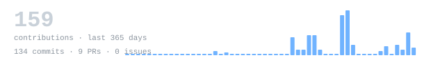
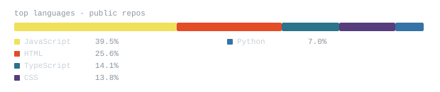
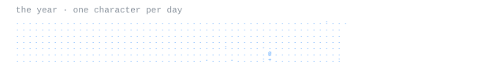

[github.com/gowsik02](https://github.com/gowsik02) &nbsp;·&nbsp;
[linkedin](https://www.linkedin.com/in/gowsik-baskaran) &nbsp;·&nbsp;
[email](mailto:gowsikbaskaran2@gmail.com)

> B.E. CSE student at PPG Institute of Technology, Coimbatore. 
> Frontend, backend, and AI developer building inclusive technology. 
> Interested in creative technology, automation, and real-world problem solving.

I build practical products that connect people with useful technology. My work spans 
web development, generative AI, IoT, and automation, with a focus on accessible 
solutions such as smart shoes for blind people, smart agriculture, and sign-language translation.

**Education** · B.E. CSE, PPG Institute of Technology (2024–2028) · CGPA 7.24 
Higher Secondary, Sri Bharathidasan Matric Higher Secondary School (81.3%) 
Secondary, St. Joseph's Matric High School (70.0%)

**Skills** · HTML · CSS · JavaScript · React.js · Node.js · Java · MySQL · MongoDB 
Git · GitHub · VS Code · Figma · Flutter · n8n · OOP · DSA

**Experience** · Web Development Intern at Techzit Innovative Solution · Generative AI Intern at SKILLIBLE (AICTE) 
Full Stack Development Intern at Medhams, where I built an eCommerce site with Node.js and MySQL.

**Certifications** · Databricks Generative AI Fundamentals · Microsoft Azure AI Fundamentals (AI-900) 
SQL, Prep Insta · Cloud Computing, NPTEL

**[Smart Shoes for Blind People](https://github.com/gowsik02)** &nbsp;·&nbsp; <samp>iot, accessibility</samp> 
Smart shoes using IoT technology to support independence for visually impaired people.

**[Smart Agriculture](https://github.com/gowsik02)** &nbsp;·&nbsp; <samp>iot, automation</samp> 
Automatic water dispenser that measures soil moisture and waters plants when needed.

**[Sign Language Translator](https://github.com/gowsik02)** &nbsp;·&nbsp; <samp>javascript, ai, accessibility</samp> 
Sign language translation software designed to make communication more accessible.

**[Weather Dashboard](https://github.com/gowsik02)** &nbsp;·&nbsp; <samp>html, css, javascript, api</samp> 
Real-time weather dashboard displaying current conditions and forecasts clearly.

**[eCommerce Platform](https://github.com/gowsik02)** &nbsp;·&nbsp; <samp>html, css, javascript, node.js, mysql</samp> 
Full-stack store with authentication, product listings, cart, and payment workflows.

**[Generative AI Work](https://github.com/gowsik02)** &nbsp;·&nbsp; <samp>generative ai, automation, n8n</samp> 
Generative AI internship projects and workflow automation experiments.

Every graphic here is generated, not embedded from anyone else's server. 
`ascii.svg` is a photo pushed through a character ramp by 
[`scripts/make_portrait.py`](scripts/make_portrait.py); the stat graphics and 
section headings are drawn by [a scheduled action](.github/workflows/stats.yml) 
straight from the GitHub GraphQL API, once a day, committing only what changed.

They animate with SMIL inside the SVG, because GitHub strips scripts from 
READMEs — and since nothing loads from a third party, nothing here can 
rate-limit or go dark. The headings are SVGs for the same reason: GitHub 
strips CSS, so an image is the only way to put this page's own typeface on them.

Language totals cover public repositories only. `year.svg` uses the portrait's 
character ramp: `:` `+` `#` `@`, quiet to loud. Contact: Coimbatore · 9003427793.
